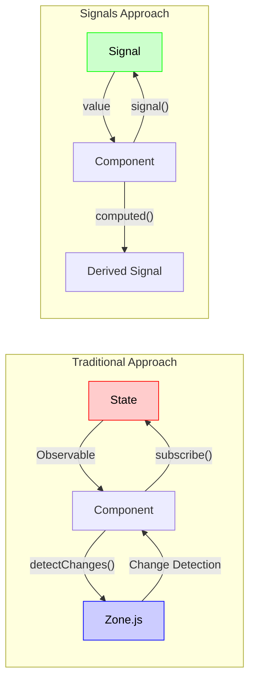
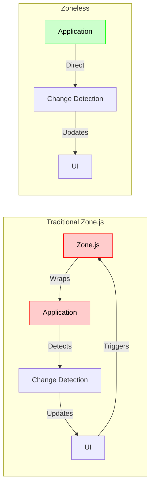

Let me provide a comprehensive explanation of these Angular concepts, starting with the Signals system:

###  Signals System in Angular

The Signals system is Angular's new reactivity primitive that simplifies state management and improves performance. Let's understand how it works:



In this diagram:

- Red components show the traditional Observable-based approach, which requires Zone.js for change detection
- Green components show the new Signals approach, which operates independently of Zone.js
- The arrows demonstrate how data flows between components and signals
- Notice how the Signals approach eliminates the need for explicit subscriptions and change detection

Let's see how this works in practice:

```typescript
// Basic Signal Usage
@Component({
  selector: 'app-counter',
  template: `
    <button (click)="counter.value += 1">
      Count: {{ counter.value }}
    </button>
  `,
  standalone: true
})
class CounterComponent {
  // Create a signal with initial value
  counter = signal(0);
}

// Computed Values
@Component({
  selector: 'app-stats',
  template: `
    <div>
      Count: {{ count }}
      Is Positive: {{ isPositive }}
      Double Count: {{ doubleCount }}
    </div>
  `,
  standalone: true
})
class StatsComponent {
  count = signal(0);
  
  // Derived signals
  readonly isPositive = computed(
    () => this.count.value > 0
  );
  
  readonly doubleCount = computed(
    () => this.count.value * 2
  );
}
```

###  Zoneless Configuration and Performance

Zoneless Angular configuration removes the Zone.js dependency, significantly improving performance. Here's how it works:



As shown in the diagram, Zoneless Angular eliminates the Zone.js wrapper, reducing overhead and improving debugging. This architecture:

- Removes the Zone.js event detection layer
- Provides direct access to change detection
- Improves debugging experience
- Reduces bundle size

Here's how to implement Zoneless Angular:

```typescript
// environment.ts
export const environment = {
  production: false,
  zoneless: true // Enable zoneless mode
};

// main.ts
import { bootstrapApplication } from '@angular/platform-browser';
import { provideRouter } from '@angular/router';
import { AppComponent } from './app/app.component';

bootstrapApplication(AppComponent, {
  providers: [
    provideRouter([
      // Your routes
    ]),
    { 
      provide: 'Zone',
      useValue: null 
    }
  ]
}).catch(err => console.error(err));
```

###  Modern Development Workflows

Angular CLI provides powerful commands for modern development. Here are the essential workflows:

```bash
# Create new project
ng new my-app --routing=false --style=css --ssr=false

# Serve application
cd my-app
ng serve

# Generate component
ng generate component my-component

# Build production
ng build --configuration=production

# Run tests
ng test

# Run E2E tests
ng e2e

# Generate documentation
ng doc
```

###  Performance Optimization

Here are key strategies to optimize your Angular application:

1. **Component-Level Optimization**```typescript
@Component({
  selector: 'app-list',
  template: `
    <div *cdkVirtualScroll="let item of itemsWithTracking">
      {{ item.name }}
    </div>
  `,
  standalone: true,
  imports: [ScrollingModule]
})
export class ListComponent implements OnInit {
  itemsWithTracking = signal([]);
  
  constructor(private changeDetectorRef: ChangeDetectorRef) {}
  
  ngOnInit() {
    // Efficient state updates
    this.itemsWithTracking.set(
      Array.from({ length: 10000 }, (_, i) => ({
        id: i,
        name: `Item ${i}`
      }))
    );
    
    // Manual change detection for critical updates
    this.changeDetectorRef.markForCheck();
  }
}
```


2. **Build Configuration**```json
{
  "projects": {
    "your-project": {
      "architect": {
        "build": {
          "configurations": {
            "production": {
              "optimization": {
                "runtimeChunk": "single"
              },
              "sourceMap": {
                "hidden": true
              },
              "buildOptimizer": true,
              "budgets": [
                {
                  "type": "initial",
                  "maximumWarning": "2mb",
                  "maximumError": "5mb"
                }
              ]
            }
          }
        }
      }
    }
  }
}
```


###  Testing Setup

Here's a complete testing configuration:

```typescript
// jest.config.js
module.exports = {
  preset: '../../jest.preset.js',
  setupFilesAfterEnv: ['<rootDir>/setup-jest.ts'],
  globals: {
    'ts-jest': {
      tsconfig: '<rootDir>/tsconfig.spec.json',
      useESM: true
    }
  },
  coverageDirectory: '../../coverage/packages/<rootDir>',
  displayName: 'your-project',
  transform: {
    '^.+\\.(ts|mjs|js|html)$': 'jest-preset-angular',
  },
  transformIgnorePatterns: ['node_modules/(?!.*\\.mjs$)'],
};

// setup-jest.ts
import '@angular/core/testing';
import { getTestBed } from '@angular/core/testing';
import {
  BrowserDynamicTestingModule,
  platformBrowserDynamicTesting
} from '@angular/platform-browser-dynamic/testing';

declare global {
  var getTestBed: () => TestingModule;
}

getTestBed().initTestEnvironment(
  BrowserDynamicTestingModule,
  platformBrowserDynamicTesting()
);

// Example test
describe('ListComponent', () => {
  beforeEach(async () => {
    await TestBed.configureTestingModule({
      declarations: [ListComponent],
      imports: [
        ScrollingModule,
        NoopAnimationsModule
      ]
    }).compileComponents();
  });

  test('should render virtualized list', fakeAsync(() => {
    const fixture = TestBed.createComponent(ListComponent);
    const component = fixture.componentInstance;
    
    // Test with large dataset
    component.itemsWithTracking.set(
      Array.from({ length: 10000 }, (_, i) => ({
        id: i,
        name: `Item ${i}`
      }))
    );
    
    tick();
    fixture.detectChanges();
    
    expect(fixture.nativeElement.querySelectorAll('div').length)
      .toBeLessThanOrEqual(10);
  }));
});
```
